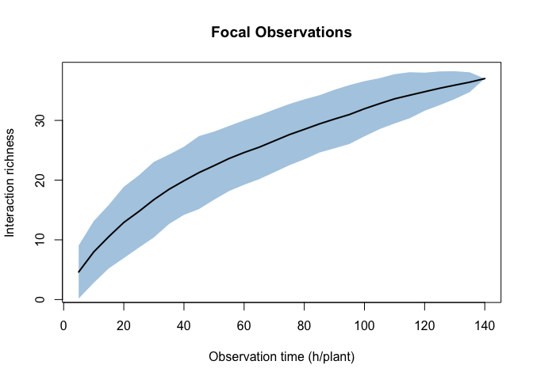
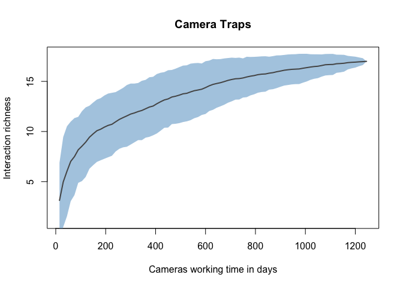
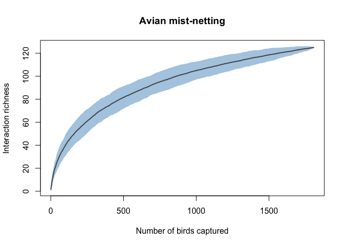
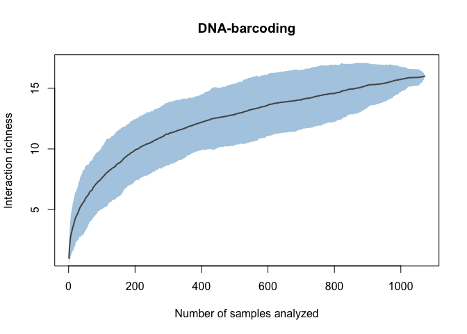

Interaction Accumulation Curves
================
Elena Quintero
2021-05-11

Here we present four examples for the computation of Interactions
Accumulation Curves (IAC) present in Figure 2 of the manuscript.

### A. FOCAL OBSERVATIONS

Example of the frugivory assemblage of *Cecropia glaziovii* individual
plants at Intervales Park (Sao Paulo, Brasil). Data obtained during
frugivory course (Pedro Jordano, Marco Aurelio Pizo, Mauro Galetti).

``` r
f.obs_raw <- read.csv ("data/Cecropia_data.csv", header = T, sep=";",)
```

Create variable named ‘species’ by pasting genera and species; and
remove undetermined species

``` r
f.obs <- f.obs_raw %>%
  dplyr::mutate(species = paste0(gen,".", sp.)) %>%
  dplyr::filter(gen!= "Indet")
```

Obtain observation matrix where each row represents one individual of
*Cecropia*, and frugivores are presented in columns.

``` r
cecropia.obs <- as.data.frame(t(f.obs[,7:34])) %>% `colnames<-`(f.obs$species)
```

**Sampling effort:** There were 28 individual plants that were observed
for continuous 5 hours on the same day.

``` r
#Generate sampling effort list
cecropia.samp.eff= rep(5,28)
```

Obtain Species Richness estimators: Chao, first order Jack knife, second
order Jack knife and Bootstrap with their respective SE.

``` r
kable(specpool(cecropia.obs))
```

|     | Species |     chao | chao.se |    jack1 | jack1.se |    jack2 |     boot |  boot.se |   n |
|-----|--------:|---------:|--------:|---------:|---------:|---------:|---------:|---------:|----:|
| All |      37 | 49.05357 | 8.18171 | 51.46429 | 5.051647 | 57.34524 | 43.67874 | 2.872962 |  28 |

where “Species” indicates the number of species encountered (in this
case 37 frugivore species), and “n” indicates the number of sampling
effort units (in this case 12 *Cecropia* individuals).

IAC curve:

``` r
curve_f.obs <- specaccum(cecropia.obs, method="random", permutations=100, w=cecropia.samp.eff, effort=5)

plot(curve_f.obs, ci.type="polygon", xvar = "effort",lwd=2, ci.lty=0,
     ci.col= rgb(116/255,169/255,207/255,.6), ylab= "Interaction richness", 
     xlab="Observation time (h/plant)", main="Focal Observations")
```

<!-- -->

### B. CAMERA TRAPS

Example of frugivory assemblage at three *Juniperus phoenicia* forest
stands in Doñana Natural Reserve (Huelva, Spain). Data from Jorge Isla’s
PhD Thesis.

``` r
cam_raw <- read.csv("data/Juniperus_cams.csv", header = T, sep=";")
```

Filter data by exclusive “feeding” behavior, and summarize data by area,
fortnight and species detected.

``` r
cam <- cam_raw %>%
  dplyr::filter(behavior=="FEEDING") %>%
  dplyr::group_by(area, fortnight, sp, ) %>%
  dplyr::summarise(n_interactions=n())
```

Convert to observation matrix where each row represent one fortnight of
data collection in each one of the areas. Columns indicate frugivore
species detected.

``` r
sab_obs<-cam %>%
  tidyr::pivot_wider(names_from= sp, values_from= n_interactions, 
                     values_fill= list(count= 0)) %>%
  replace(is.na(.), 0)
```

**Sampling effort:** Cameras traps (n=X?) were revised every 15 days in
each area

``` r
#Generate sampling effort list
juniperus_samp_eff <- rep(15,83)
```

Obtain Species Richness estimators:

``` r
kable(specpool(sab_obs[,-c(1:2)],sab_obs$area))
```

|        | Species |     chao |   chao.se |    jack1 | jack1.se |    jack2 |     boot |   boot.se |   n |
|--------|--------:|---------:|----------:|---------:|---------:|---------:|---------:|----------:|----:|
| SABCOL |      14 | 21.71429 | 11.257651 | 17.85714 | 1.928571 | 20.67725 | 15.70014 | 1.1088034 |  28 |
| SABMAR |      10 | 14.33929 |  6.947989 | 12.89286 | 1.670192 | 14.78439 | 11.27892 | 0.9040951 |  28 |
| SABOJI |      11 | 12.92593 |  3.612963 | 12.92593 | 1.361835 | 13.88746 | 11.87050 | 0.7786169 |  27 |

where “Species” indicates the number of species encountered (in this
case 14, 10 and 11 frugivore species for each *Juniperus* stand), and
“n” indicates the number of sampling effort units (28, 28 and 27
fortnights in each *Juniperus* stand).

IAC curve:

``` r
curve_cam <- specaccum(sab_obs[,-c(1:2)], method="random", permutations=100, effort=15, w=juniperus_samp_eff)

plot(curve_cam, ci.type="polygon",col="#555555", lwd=2, ci.lty=0, 
     ci.col= rgb(116/255,169/255,207/255,.6), ylab="Interaction richness", 
     xvar = "effort",
     xlab="Cameras working time in days", main="Camera Traps")
```

<!-- -->

### C. AVIAN MIST-NETTING

Example of frugivory assemblage at Hato Ratón in Doñana National Park
(Huelva, Spain) from diet samples obstained from mist-netted birds
between 1980-1983. Data from Pedro Jordano’s PhD Thesis.

``` r
mist.net_raw <- read.csv("data/Interactions_HR_1980.csv", sep=";")
```

Give a unique ID number for each bird capture, calculate total number of
seeds per bird species and give a unique name for each sp-sp pairwise
interaction.

``` r
mist.net <- mist.net_raw %>%
            dplyr::mutate(sample=row_number()) %>% 
            tidyr::pivot_longer(cols=4:20,names_to = "disperser", 
                                values_to= "count") %>% 
            dplyr::mutate(interaction= paste(SPECIES,disperser))
```

Convert to observation matrix where each row represents a bird captured
(*i.e.*, a diet sample), and columns represent avian frugivores.

``` r
mist.net <- mist.net %>% 
           tidyr::pivot_wider(id_cols=sample, names_from = interaction, 
                              values_from= count, 
                              values_fill= list(count= 0), 
                              names_repair= "unique")
```

**Sampling effort:** there was a total of 1808 birds captured of which
374 did not have fruits/seed in their diet.

Obtain Interactions richness estimators:

``` r
kable(specpool(mist.net[,-1]))
```

|     | Species |    chao |  chao.se |    jack1 | jack1.se |    jack2 |     boot |  boot.se |    n |
|-----|--------:|--------:|---------:|---------:|---------:|---------:|---------:|---------:|-----:|
| All |     125 | 163.512 | 17.66017 | 158.9812 |  6.32132 | 177.9685 | 140.4538 | 3.576424 | 1808 |

where “Species” indicates the number of **interactions** encountered (in
this case 125 unique frugivore-plant pariwise interactions), and “n”
indicates the number of sampling effort units (in this case 1808 diet
samples).

IAC curve:

``` r
curve_mist.net <- specaccum(mist.net[,-1], method="random",permutations=100)

plot(curve_mist.net, ci.type="polygon",col="#555555", lwd=2, ci.lty=0, 
      ci.col= rgb(116/255,169/255,207/255,.6), ylab="Interaction richness", 
      xlab="Number of birds captured", main="Avian mist-netting")
```

<!-- -->

### D. DNA-Barcoding

Example for frugivory assemblage of *Pistacia lentiscus* individual
plants in La Mancha del Rabicano, El Puntal in Doñana National Park
(Huelva, Spain). Data from Elena Quintero’s PhD Thesis.

``` r
dna.bc_raw <- read.csv("data/Pistacia_barcoding_winter.csv", header = T, sep=",",) 
```

Convert to observation matrix where each row represent a individual
sample analyzed (*i.e.*, fecal sample or regurgitated seed), and columns
represent avian frugivores.

``` r
dna.bc <- dna.bc_raw %>%
   dplyr::select(-X) %>%
   tidyr::pivot_wider(names_from = disperser, values_from = priority, 
                      values_fill= list(priority= 0))
```

Obtain Species Richness Estimators

``` r
kable(specpool(dna.bc[,-c(1,2)]))
```

|     | Species |     chao |  chao.se |    jack1 | jack1.se |    jack2 |     boot |  boot.se |    n |
|-----|--------:|---------:|---------:|---------:|---------:|---------:|---------:|---------:|-----:|
| All |      16 | 28.48834 | 17.12349 | 20.99534 | 2.233982 | 24.98881 | 18.04384 | 1.158593 | 1072 |

where “Species” indicates the number of species encountered (in this
case 16 frugivore species), and “n” indicates the number of sampling
effort units (in this case 1072 fecal/seed samples collected in seed
traps settled under *Pistacia lentiscus* individuals).

IAC curve:

``` r
curve_pun <- specaccum(dna.bc[,-c(1,2)], method="random",permutations=100)

plot(curve_pun, ci.type="polygon",col="#555555", lwd=2, ci.lty=0, 
     ci.col=rgb(116/255,169/255,207/255,.6), ylab="Interaction richness", 
     xlab="Number of samples analyzed", main="DNA-barcoding")
```

<!-- -->

------------------------------------------------------------------------

    ## Last update:  Tue May 11 13:20:05 2021 
    ## 

    ## R version 4.0.0 (2020-04-24)
    ## Platform: x86_64-apple-darwin17.0 (64-bit)
    ## Running under: macOS  10.16
    ## 
    ## Matrix products: default
    ## BLAS:   /Library/Frameworks/R.framework/Versions/4.0/Resources/lib/libRblas.dylib
    ## LAPACK: /Library/Frameworks/R.framework/Versions/4.0/Resources/lib/libRlapack.dylib
    ## 
    ## locale:
    ## [1] en_US.UTF-8/en_US.UTF-8/en_US.UTF-8/C/en_US.UTF-8/en_US.UTF-8
    ## 
    ## attached base packages:
    ## [1] stats     graphics  grDevices utils     datasets  methods   base     
    ## 
    ## other attached packages:
    ##  [1] summarytools_0.9.9 tidylog_1.0.2      knitr_1.28         vegan_2.5-6       
    ##  [5] lattice_0.20-41    permute_0.9-5      fossil_0.4.0       shapefiles_0.7    
    ##  [9] foreign_0.8-78     maps_3.3.0         sp_1.4-5           forcats_0.5.0     
    ## [13] stringr_1.4.0      dplyr_1.0.5        purrr_0.3.4        readr_1.3.1       
    ## [17] tidyr_1.1.0        tibble_3.1.0       ggplot2_3.3.3      tidyverse_1.3.0   
    ## 
    ## loaded via a namespace (and not attached):
    ##  [1] httr_1.4.1         jsonlite_1.7.2     splines_4.0.0      modelr_0.1.8      
    ##  [5] assertthat_0.2.1   highr_0.8          pander_0.6.3       cellranger_1.1.0  
    ##  [9] yaml_2.2.1         pillar_1.5.1       backports_1.1.7    glue_1.4.2        
    ## [13] digest_0.6.27      pryr_0.1.4         checkmate_2.0.0    rvest_0.3.5       
    ## [17] colorspace_2.0-0   plyr_1.8.6         htmltools_0.5.1.1  Matrix_1.2-18     
    ## [21] clisymbols_1.2.0   pkgconfig_2.0.3    broom_0.5.6        haven_2.3.0       
    ## [25] magick_2.7.1       scales_1.1.1       mgcv_1.8-31        generics_0.1.0    
    ## [29] ellipsis_0.3.1     withr_2.4.1        cli_2.4.0          magrittr_2.0.1    
    ## [33] crayon_1.4.1       readxl_1.3.1       evaluate_0.14      fs_1.5.0          
    ## [37] fansi_0.4.2        nlme_3.1-147       MASS_7.3-51.5      xml2_1.3.2        
    ## [41] rapportools_1.0    tools_4.0.0        hms_0.5.3          lifecycle_1.0.0   
    ## [45] matrixStats_0.58.0 munsell_0.5.0      reprex_0.3.0       cluster_2.1.0     
    ## [49] compiler_4.0.0     rlang_0.4.10       grid_4.0.0         rstudioapi_0.11   
    ## [53] tcltk_4.0.0        base64enc_0.1-3    rmarkdown_2.6      codetools_0.2-16  
    ## [57] gtable_0.3.0       DBI_1.1.0          R6_2.5.0           lubridate_1.7.10  
    ## [61] utf8_1.2.1         stringi_1.5.3      parallel_4.0.0     Rcpp_1.0.6        
    ## [65] vctrs_0.3.7        dbplyr_2.1.0       tidyselect_1.1.0   xfun_0.20
