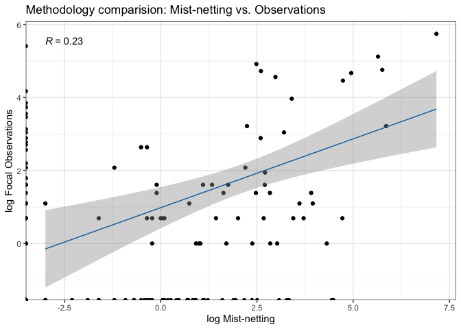
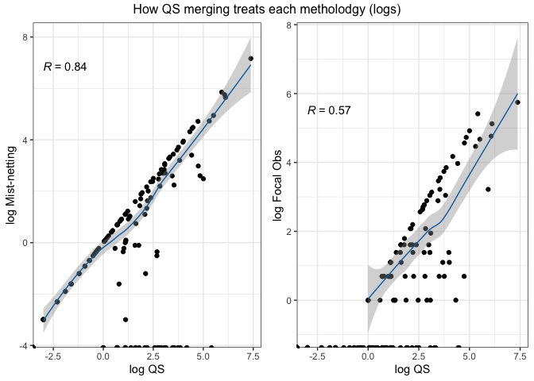
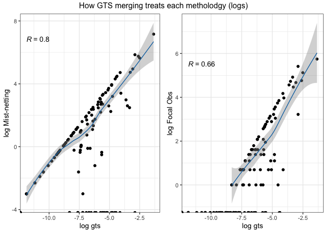
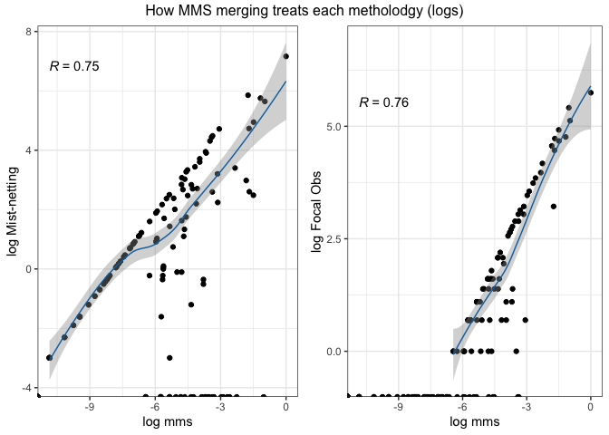

Hato Ratón correlations
================
Elena Quintero
2021-05-11

``` r
library(tidyverse)
library(tibble)
library(RColorBrewer)
library(gridExtra)
library(ggplot2)
library(ggpubr)
```

Read data

``` r
mn <- read.csv("../Case_studies_datasets/hr_mn_clean.csv",header=T,sep=",",dec=".")%>% 
    column_to_rownames(var="AASPECIES")
obs <- read.csv("../Case_studies_datasets/hr_obs_clean.csv",header=T,sep=",",dec=".")%>% 
    column_to_rownames(var="AASPECIES")
QC <- read.csv("../Data_merging/HR_QC.csv",header=T,sep=",",dec=".")%>% 
    column_to_rownames(var="X")
QS <- read.csv("../Data_merging/HR_QS.csv",header=T,sep=",",dec=".")%>% 
    column_to_rownames(var="X")
GTS <- read.csv("../Data_merging/HR_GTS.csv",header=T,sep=",",dec=".")%>% 
    column_to_rownames(var="X")
MMS <- read.csv("../Data_merging/HR_MMS.csv",header=T,sep=",",dec=".")%>% 
    column_to_rownames(var="X")
```

Apply long format to matrices:

Combine all merging methods together in a single dataset and calculate a
Coefficient of Variation for ‘Standardizing’ methods

## COMPARING BETWEEN QUANTITATIVE METHODS

<!-- -->
outlier: *Pistacia lentiscus - Sylvia atricapilla*

Now with data log-transformed to control for 0 inflated matrices.
<!-- -->

-   **All correlations showed in the graphs are kendall’s tau (based in
    ranking for non-parametric data).**
-   All methods are relatively similar, since they are highly
    correlated.
-   Less correlated QS and MMS.

### METHODS CORRELATIONS

``` r
pearson <- cor(x=all.long[,c(3,4,6:8)], method = "pearson")

kendall <- cor(x=all.long[,c(3,4,6:8)], method = "kendall")
```

Correlation plot:

``` r
library(corrplot)
```

    ## corrplot 0.84 loaded

``` r
library(RColorBrewer)

col <- colorRampPalette(c("white", "white","white", "white","white", "white", "white",  "white", "white","#D9EF8B","#A6D96A","#66BD63"))

col2 <- colorRampPalette(c("white", "white","white", "white","white", "white", "white",  "white", "white","#edf8b1","#7fcdbb","#2c7fb8"))

corrplot(pearson, method = "color",type="upper",number.cex = .7,addCoef.col="black", tl.col = "black", col=col2(40), title="Pearson UP vs Kendall DOWN", tl.pos = "d",tl.srt = 45, cl.pos = "n")

corrplot(kendall, method = "color",type="lower",number.cex = .7,addCoef.col=T, tl.col = "black",  col=col2(40),diag = FALSE, tl.pos = "n", cl.pos = "n",add=T)
```

<!-- -->

### COMPARING METHODOLOGIES WITH MERGING METHODS

*Number of registers for each methodology*

Mist-Netting:

    ## [1] 3540.85

Focal Observations:

    ## [1] 2031

Here we observe the relationship between the 2 methodologies used in the
field (logarithm converted):

<!-- -->

All points standing on the x and y-axis are interactions undetected with
one or the other method.

### How well each “merging method” values the different two methodologies

#### QUANTITATIVE SUM (QS)

Log transformed:

``` r
QS_mn_log <- ggplot(data=all.long, aes(x=log(visits.qs), y=log(visits.mn)))+geom_point()+
  theme_bw()+ylab("log Mist-netting")+xlab("log QS")+
  geom_smooth(color="#0570b0", size=0.5)+
  #geom_smooth(method=lm, color="violetred1", size=0.5)+ 
  stat_cor(aes(label = ..r.label..), method="kendall")

QS_obs_log <- ggplot(data=all.long, aes(x=log(visits.qs), y=log(visits.obs)))+geom_point()+
  theme_bw()+ylab("log Focal Obs")+xlab("log QS")+
  geom_smooth(color="#0570b0", size=0.5)+
  #geom_smooth(method=lm, color="violetred1", size=0.5)+ 
  stat_cor(aes(label = ..r.label..), method="kendall")

grid.arrange(QS_mn_log, QS_obs_log, ncol=2, top="How QS merging treats each metholodgy (logs)")
```

<!-- -->

#### Grand Total Standarization (GTS)

Log transformed:

<!-- -->

#### MIN-MAX SCALING (MMS)

Log transformed:

<!-- -->

SUMMARY:

-   Higher correlation (Kendall) of QS and GTS methods with the
    mist-netting data.
