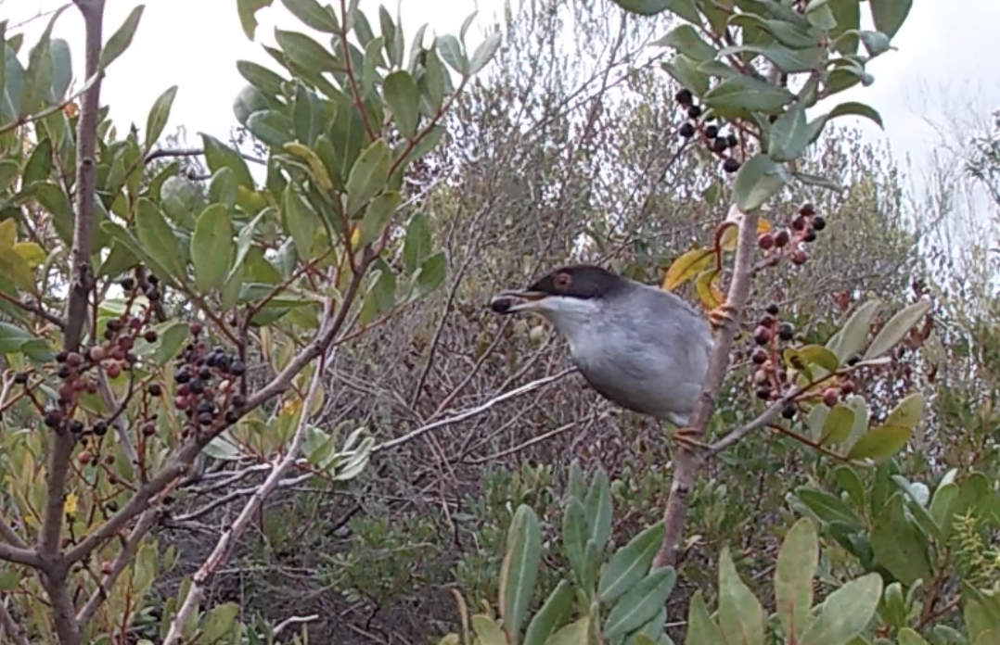

# MS_Oikos

This is a public repository for the data, analysis, and code included in our paper:

**Title**: Methodological overview and data-merging approaches in the study of plant-frugivore interactions

**Authors:** Elena Quintero^1^, Jorge Isla^1^ and Pedro Jordano^1,2^

1\. Estación Biológica de Doñana, CSIC, Av. Americo Vespucio 24, E-41092 Sevilla, Spain

2\. Dept. Biología Vegetal y Ecología, Universidad de Sevilla, Sevilla, Spain

{width="689"}

**Abstract:** Recording species interactions is one of the main challenges in ecological studies. Frugivory has received much attention for decades as a model for mutualisms among free-living species, and a variety of methods have been designed and developed for sampling and monitoring plant-frugivore interactions. The diversity of techniques poses an important challenge when comparing, combining, or replicating results from different sources with different methodologies. With the emergence of modern techniques, such as molecular analysis or multimedia remote recorders, issues when combining data from different sources has become especially relevant. We provide an overview of all the techniques used for monitoring endozoochorous primary seed dispersal, focusing on a critical appraisal of the advantages and limitations, as well as the context-dependency nature, of the different methods. We propose five data merging approaches potentially useful to combine frugivory interactions data from different methodologies. Additionally, we provide two case studies where we combine empirical data from plant-animal interactions in Mediterranean shrublands using different methodologies. Data merging resulted in an increase of the interaction data detected, and affected topology metrics of the final plant-frugivore networks. These case studies clarify the context-dependent character of the merging approaches, highlighting the value of collecting detailed information on the sampling effort in terms of reliable results and reproducibility. Finally, we discuss the trends with different methodological approaches used in the last decades and future perspectives in this field.
